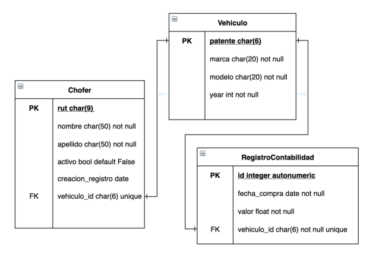

# modelo_django
Descripción
En el presente desafío, se realizará el modelamiento de un pequeño sistema, básico en cuanto
a funcionalidades, pero que nos permitirá realizar un análisis similar a lo que se necesitaría
en un sistema comercial, donde debemos relacionar modelos y crear operaciones que nos
permitan la operación con los datos que guardaremos en la base de datos.
En este desafío construiremos el modelo de datos para una empresa que maneja vehículos
utilitarios de reparto. Estos vehículos son asignados a un chofer y también tienen su registro
único en contabilidad como muestra el diagrama. 

Para este proyecto se debe desarrollar:
Los modelos de acuerdo al diagrama. Los servicios que nos darán la interfaz para trabajar
con el modelo. Estos son:
● crear_vehiculo
● crear_chofer
● crear_registro_contable
● deshabilitar_chofer
● deshabilitar_vehiculo
● habilitar_chofer
● habilitar_vehiculo
● obtener_vehiculo
● obtener_chofer
● asignar_chofer_a_vehiculo
● imprimir_datos_vehiculos

